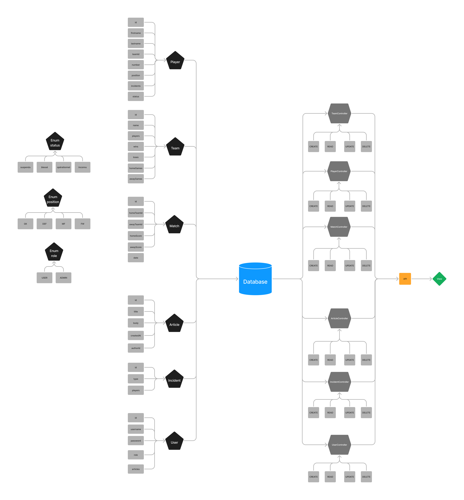
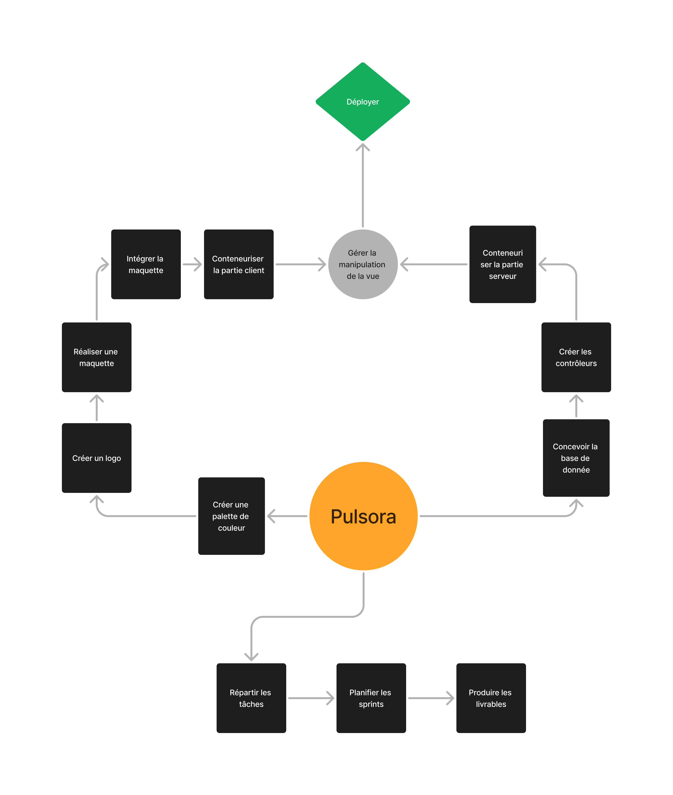
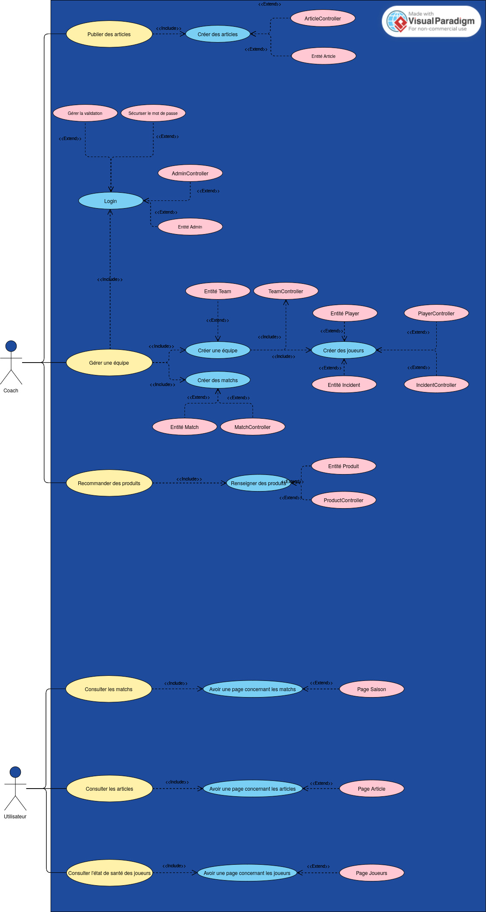

### Auteur : jpkamdem

Pulsora est un projet d’application web gratuite dédiée à la gestion des équipes
sportives. Conçue pour les entraîneurs, les joueurs et les responsables de clubs,
cet outil facilite l'organisation et la communication au sein des équipes. Elle
permet aux fans de vos projets sportifs de suivre votre actualité, l’actualité des
joueurs (blessures, sanctions...) qu’elle soit sportive ou extra-sportive au travers
d’articles publiées par vos soins.

### Méthode AGILE

La méthode AGILE repose sur des cycles de travails courts appelés sprints, afin
de livrer des versions incrémentales du produit. Cette approche a été choisie car
elle permet d’effectuer des tests à chaque ajout, garantissant que chaque
implémentation ne crée aucun bugs critiques tout en minimisant la dette
technique pouvant être accumulée via des mises à jours moins fréquentes mais
plus conséquentes.

### Objectifs et attentes du projet

L’objectif principal de ce projet est de développer une application permettant de
suivre une équipe sportive, plus particulièrement l’état de santé des joueurs.
Cette solution vise à

- Créer et gérer sa propre équipe sportiv
- Suivre l’état de santé des joueurs ainsi que leur nutritio
- Mettre en avant les produits recommandés par les joueur
- Publier des articles en lien avec les activités du club

En fournissant un outil de gestion gratuit, même les équipes amateurs avec un
budget réduit pourront avoir un moyen de gérer les activités de son club de
façon efficace

### Architecture Model View Controller



### Carte mentale



### Diagramme des Use Cases



### Diagramme des classes


### Modèle physique des données


### Stack

#### Front

- React
- TailwindCSS

#### Back

- Docker
- PostgreSQL
- Express.js
- Prisma

Tout le projet est réalisé avec TypeScript.

Ce repo était initialement destiné à l'API. L'interface web présente vient d'un autre repo. [Voir plus.](https://github.com/darryl-sangare/pulsora.git)

## Déploiement

#### Prérequis

- Docker
- Node.js

Créez 2 fichiers .env identiques, l'un à la racine pulsora-final/, l'autre à l'emplacement pulsora-final/api/ et collez-y ceci :

```env
POSTGRES_DB=mydb
POSTGRES_USER=myuser
POSTGRES_PASSWORD=mypassword
dev=localhost
prod=db

DATABASE_URL=postgresql://${POSTGRES_USER}:${POSTGRES_PASSWORD}@${prod}:5432/${POSTGRES_DB}?schema=public
```

Selon la méthode de déploiement que vous choisirez, veuillez modifier la variable dev ou prod dans l'URL de la base de donnée dans les 2 fichiers.

#### Développement

```bash
cd pulsora-final/web
npm i
npm run dev
cd ../api/
npm i
docker compose up -d
npx prisma db push
npm run dev
```

#### Production

```bash
cd pulsora-final/
docker compose up --wait
```

Assurez-vous d'avoir bel et bien modifié les valeurs précisées ci-dessus <b>avant la construction des images</b>.
Si les données ne sont pas chargées convenablement, veuillez écrire la commande suivante :

```bash
docker compose restart api
```

La base de donnée a besoin de quelques secondes avant de pouvoir être disponible, il est possible que l'API démarre trop rapidement. Ce cas de figure peut arriver si vous privilégiez de construire et de lancer les images séparément. Je vous recommande de vous tenir aux commandes présentées ci-dessus.
